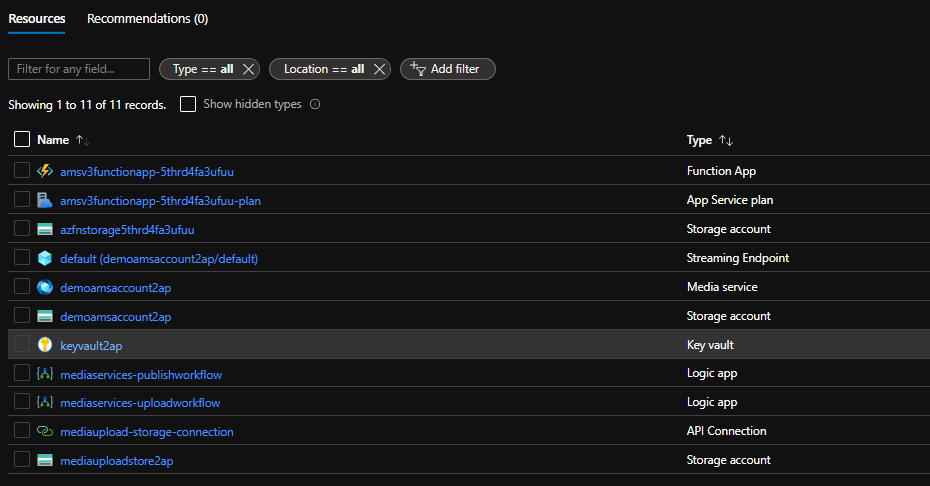
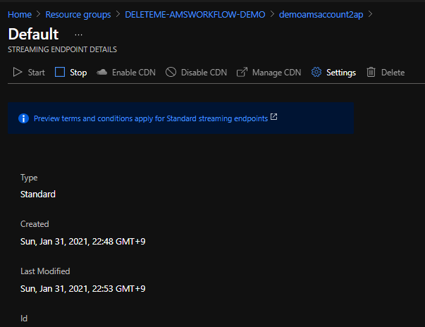
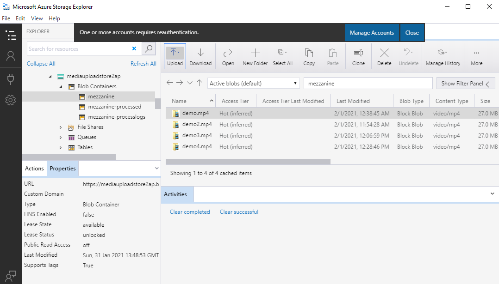
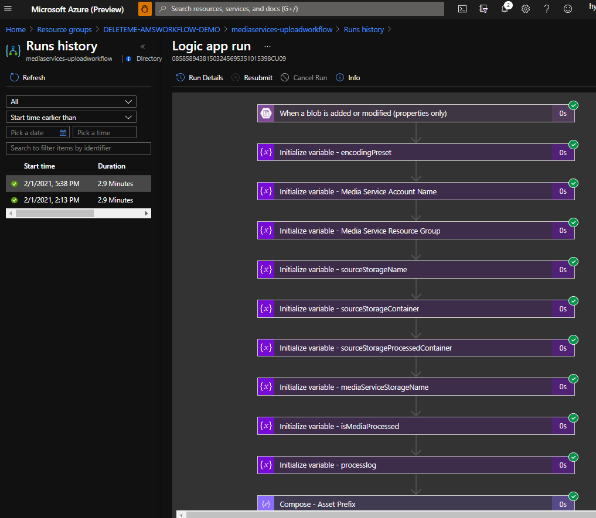
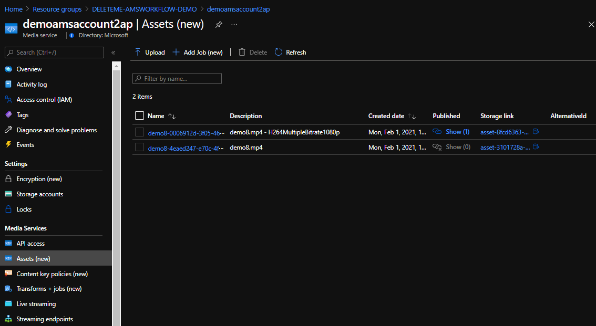
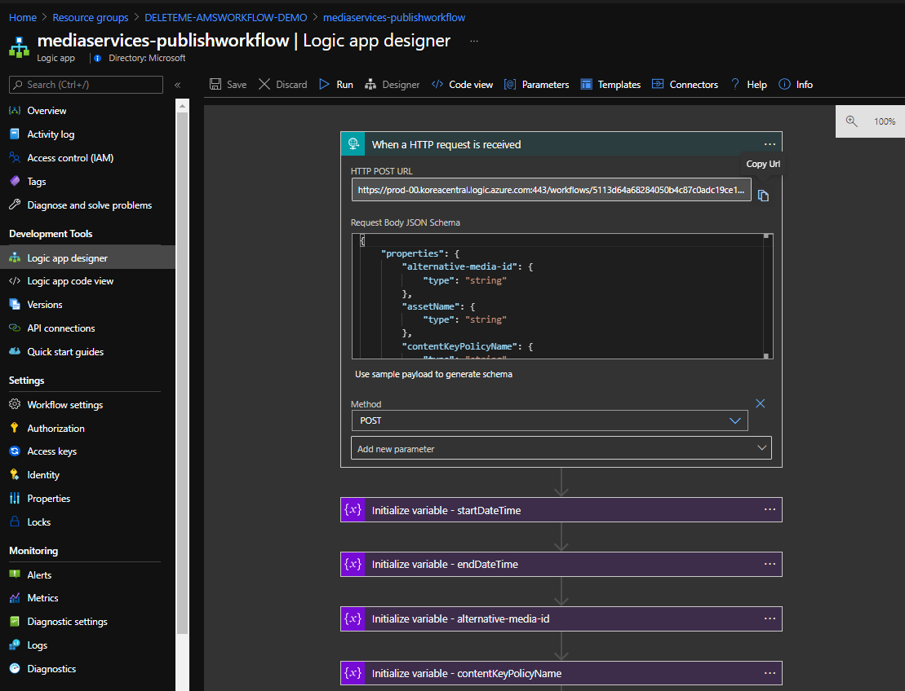

# azure-media-service-workflow-demo
This is Azure Media Service workflow demo with Azure Logic App and Azure Function.

This demo is based on the work from the repository below and re-written in terraform for quicker demo deployment. 

https://github.com/raffertyuy/media-services-v3-dotnet-core-functions-integration

Below are steps for the demo.

Pre-requisite:

- Install terraform on your machine.


1. Clone this repo.

   ```bash
   $ git clone https://github.com/hyundonk/azure-media-service-workflow-demo.git
   $ cd azure-media-service-workflow-demo
   ```

2. Modify below 2 variable values in terraform variable definition file ("terraform.tfvars")

```bash
# Enter below values from a service principal that has contributor role on your Azure subscription
client_id     = "{Put your client_id of service principal}"
client_secret = "{Put your client_secret of service principal}"
```

3. Run "terraform init"

```bash
# Environment variables for the service principal that Terraform will use
export ARM_TENANT_ID={Put your Azure AD Tenant ID}
export ARM_SUBSCRIPTION_ID={Put your subscription ID}
export ARM_CLIENT_ID={Put your client_id of service principal}
export ARM_CLIENT_SECRET={Put your client_secret of service principal}

terraform init -backend-config="storage_account_name={put your storage account name for terraform backend}" -backend-config="container_name={put your container name}" -backend-config="access_key={put your storage account key value} -backend-config="key={put path for the backend file}""
```


4. Run "terraform apply"

```bash
terraform apply
```

The the following Azure resources will be created.



5. Select the Media Service resource (demoamsaccountxxx) and select "Streaming endpoints" menu and select "default" endpoint. Click "Start" button to start the "default" streaming endpoint.




6. "mediaservcies-uploadworkflow" Logic App contains workflow for mp4 file upload and transcoding. Install and launch "Azure Storage Explorer". Select "mediauploadstorexxx" storage account -> "mezzanine" container. Upload a sample mp4 file to the container.




7. Within 30 sec, "mediaservcies-uploadworkflow" will run as below. 



8. After successful run, a new asset encoded with "H264MultipleBitrate1080p" preset will be created in the media service account as below.




9. "mediaservcies-publishworkflow" Logic App contains workflow for publishing a media service asset. Create a "data.json" file which contains necessary information for publishing an asset. 

```bash
$ cat data.json
{
    "assetName": "demo8-0006912d-3f05-xxxx-949a-xxxxxx27434e",
    "streamingPolicyName": "Predefined_ClearStreamingOnly",
    "alternative-media-id": "mytestmedia",
    "contentKeyPolicyName": "defaultContentKeyPolicy",
    "contentKeys": null,
    "startDateTime": "2021-01-31T09:00Z",
    "endDateTime": "2021-02-07T23:59Z",
    "streamingLocatorId": "f1c651dc-f42a-46b8-9e64-xxxx19421f22"
}
```


9. To run the workflow, use curl command to send HTTP POST method to the callback URL. After successful run, a streaming URL for publishing will be created.



```bash

$ curl -d "@data.json" -H "Content-Type: application/json" -X POST "https://prod-00.koreacentral.logic.azure.com:443/workflows/xxxxxxxxxxxxxxxxxxxxxxxxx/triggers/manual/paths/invoke?api-version=2016-10-01&sp=%2Ftriggers%2Fmanual%2Frun&sv=1.0&sig=soN7IpFQ1O..."
{"downloadPaths":[],"streamingPaths":[{"StreamingProtocol":"Hls","EncryptionScheme":"NoEncryption","StreamingUrl":"https://demoamsaccountxxx-koct1.streaming.media.azure.net/f1c651dc-f42a-46b8-9e64-4e29xxxxxxxx/demo8.ism/manifest(format=m3u8-aapl)"},{"StreamingProtocol":"Dash","EncryptionScheme":"NoEncryption","StreamingUrl":"https://demoamsaccountxxx-koct1.streaming.media.azure.net/f1c651dc-f42a-46b8-9e64-4e29xxxxxxxx/demo8.ism/manifest(format=mpd-time-csf)"},{"StreamingProtocol":"SmoothStreaming","EncryptionScheme":"NoEncryption","StreamingUrl":"https://demoamsaccountxxx-koct1.streaming.media.azure.net/f1c651dc-f42a-46b8-9e64-4e29xxxxxxxx/demo8.ism/manifest"}]}
```


10. Use "StreamingUrl" above in media player to play the streaming 


Thanks!